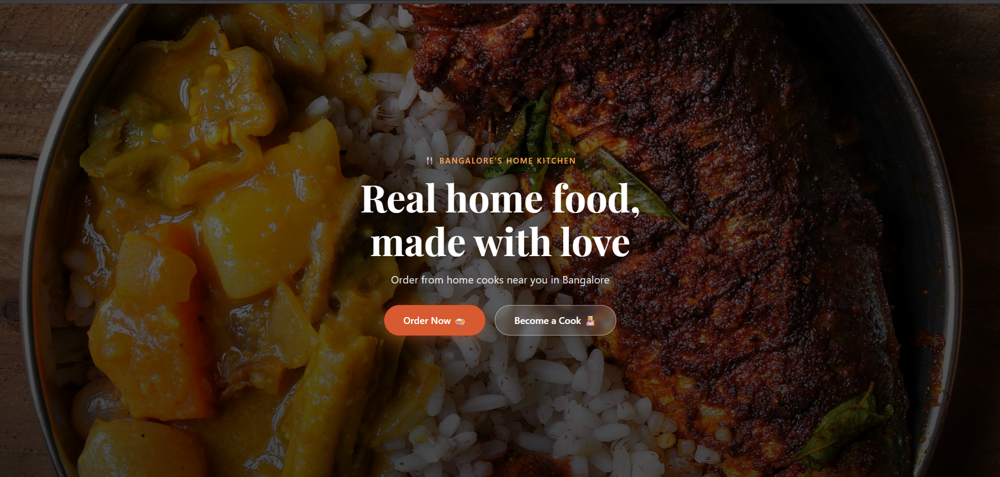
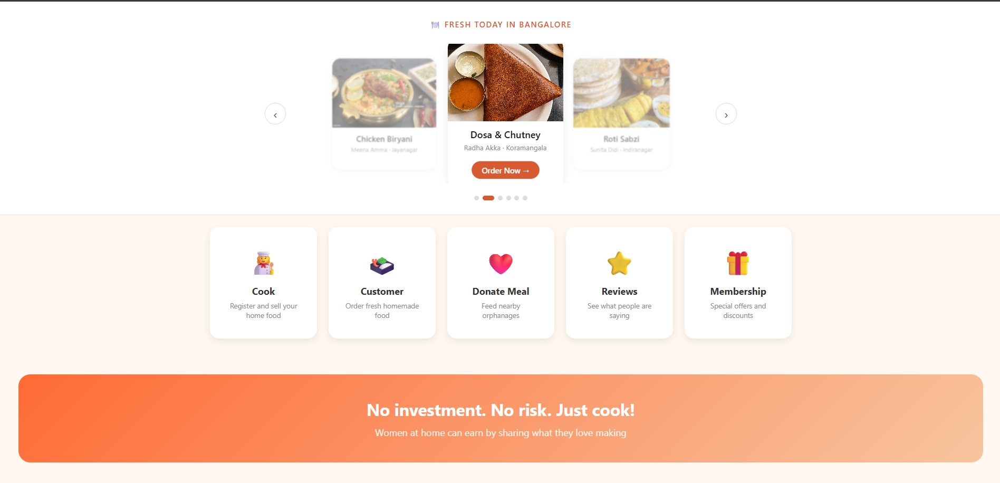
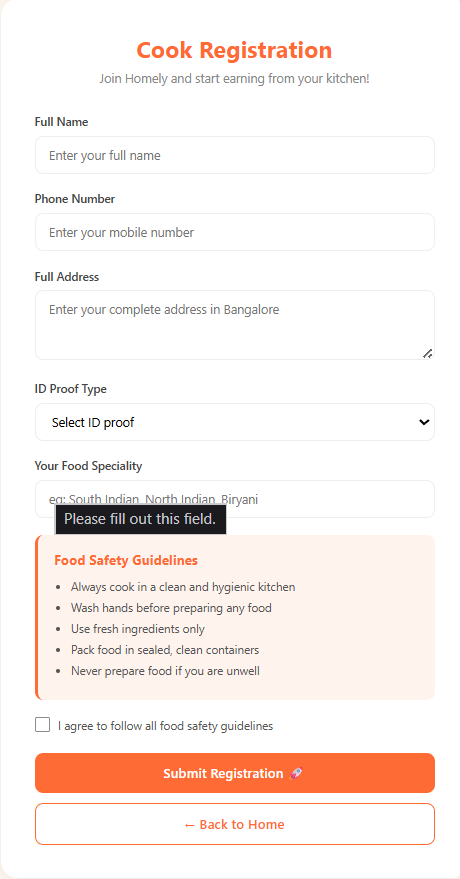
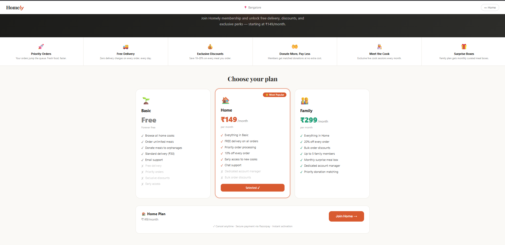
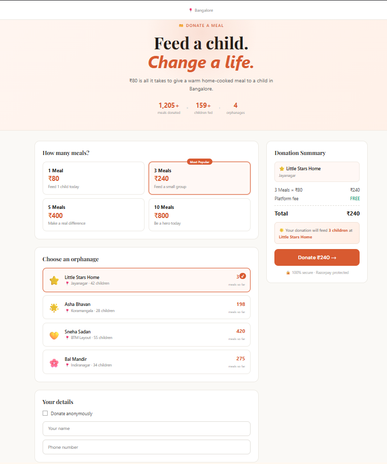
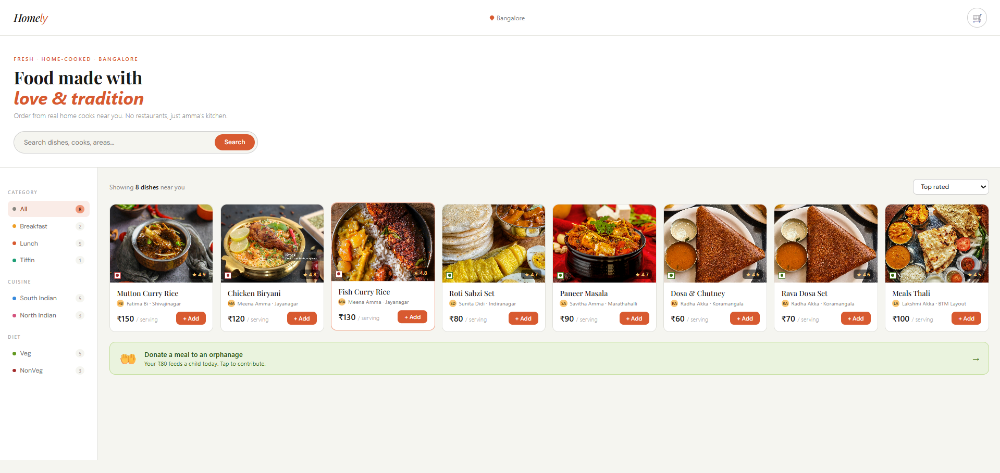

# HomeFood Startup

## Overview

HomeFood Startup is a web application that connects home-based cooks with customers looking for healthy homemade meals. The platform allows cooks to register, upload food items, and manage orders, while customers can browse menus and place orders.

## Features

- User-friendly Homepage
- Customer Dashboard
- Cook Dashboard
- Membership Dashboard
- Donation Dashboard
- Food Menu Management
- Order Management

## Technologies Used

- React.js
- JavaScript
- HTML
- CSS
- Node.js
- Express.js
- MongoDB (In Progress)

## Screenshots

### Homepage

### Dashboard

### Cook Dashboard

### Membership Dashboard

### Donation Dashboard

### Menu

## Future Enhancements

- User Authentication
- Payment Gateway Integration
- Real-time Order Tracking
- Cloud Deployment using AWS

## Author

Manoj S
>>>>>>> 4e7a2d8f2bf9f18e7f2f5687c95fab1e08d3fc6e
